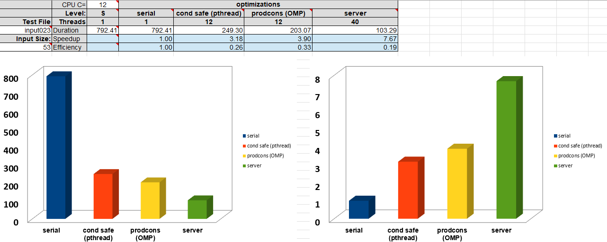
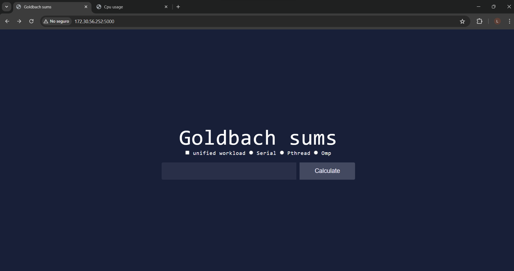
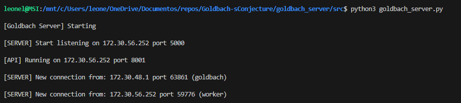
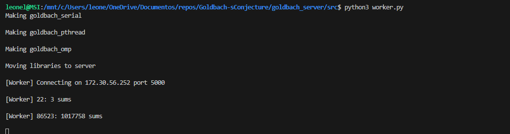
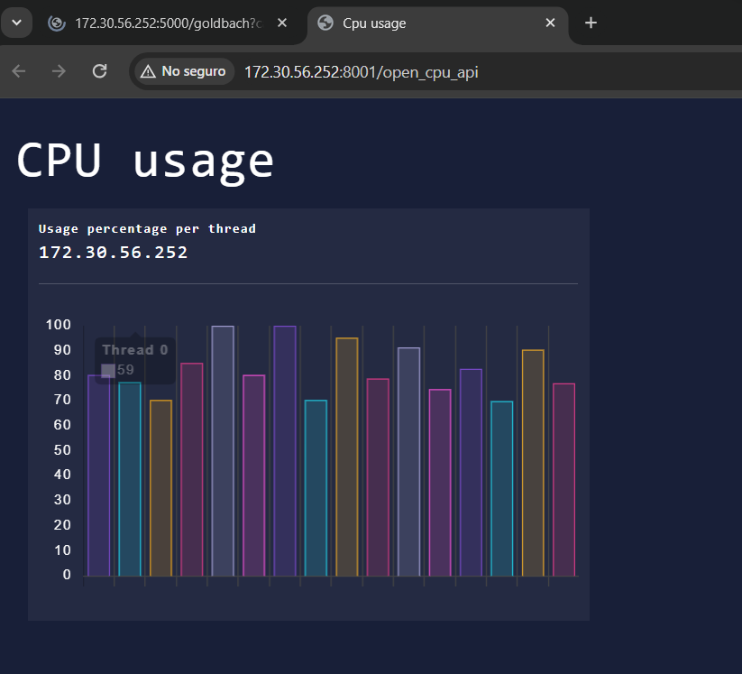
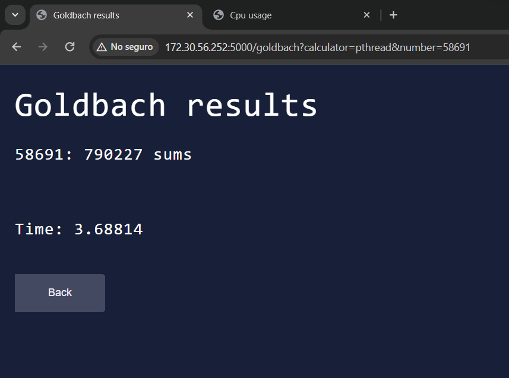

# Goldbach's conjecture

The mathematical problem known as the goldbach conjecture; Proposes that every positive, greater than two, even number can be written as the sum of two prime numbers. What is known as "strong conjecture".

- 14: 2 sums: 3 + 11, 7 + 7
- 8: 1 sums: 3 + 5

On the other hand, the "weak conjecture" proposes that every positive, greater than five, odd number can be written as the sum of three prime numbers.

- 9: 2 sums: 2 + 2 + 5, 3 + 3 + 3
- 21: 5 sums: 2 + 2 + 17, 3 + 5 + 13, 3 + 7 + 11, 5 + 5 + 11, 7 + 7 + 7

## Project Overview

The purpose of this project is to create a brute force solution (for numbers greater than 5) which is expected to be slow; Then try to optimize it using different technologies and concurrency patterns implemented in the C programming language.

## Key Features
- **Goldbach Serial**: This is the brute-force and slowest solution, writen in c. 
 

**Time calculating file input023: 792.41 seconds (1 thread)**

 

- **Goldbach Pthread (Conditonally safe)**: Each thread does its work and places its results in a region of memory that only it can access.
 

**Time calculating file input023: 249.303 seconds (12 threads)**

 

- **Goldbach OMP (Producer-Consumer)**: There are many variants of the producer-consumer problem. In this case, first all the work is produced serially, and later consumers consume the work.

**Time calculating file input023: 203.07 seconds (12 threads)**

 

- **Goldbach Server**: In this solution, i built a server/worker web architecture that allows the creation of a distributed cluster coordinated by the server using multiple laptops, utilizing all their threads as workers to solve the conjecture.

**Time calculating file input023: 103.20 seconds (40 threads)**

<table>
        <tr>
            <td></td>
            <td></td>
        </tr>
    </table>
Also, i provide a cpu usage page where you can monitor all the workers connected to the system.
 <table>
        <tr>
            <td></td>
            <td></td>
        </tr>
    </table>
 

## Running the app
<a href="https://github.com/LeonelCamposM/Goldbach-sConjecture/blob/main/goldbach_server/README.md">Setup instructions</a>

