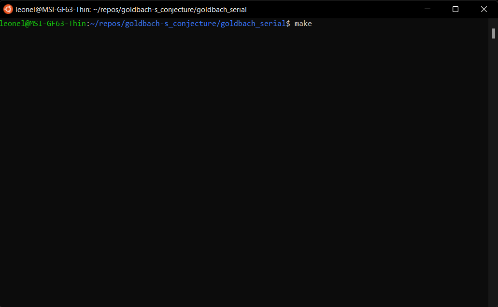
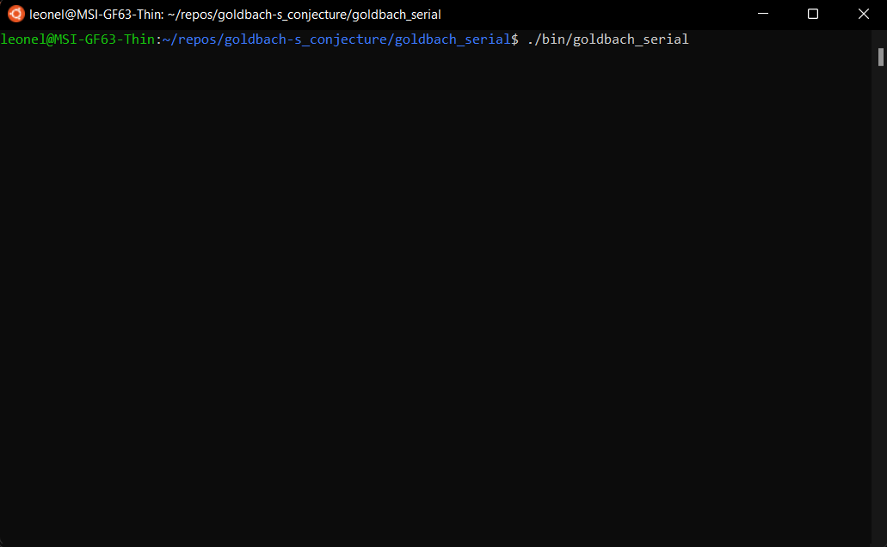
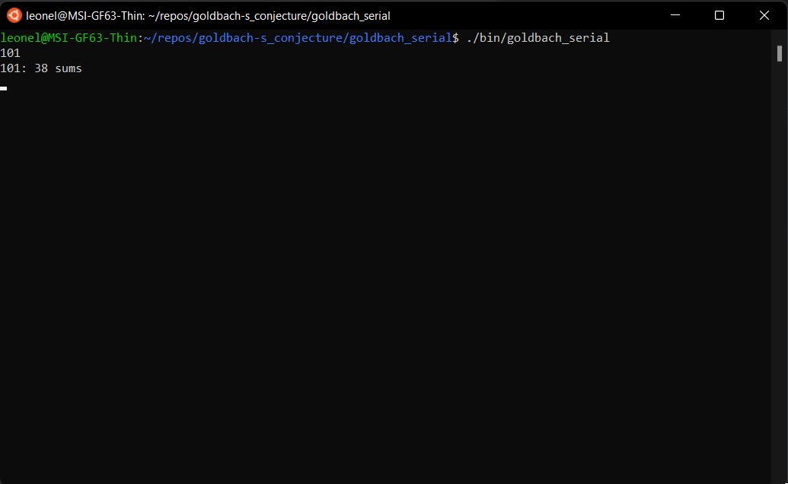
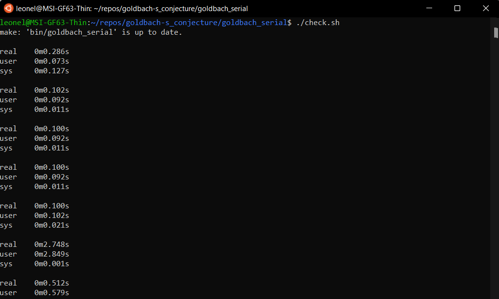

# Goldbach's conjecture

The mathematical problem known as the goldbach conjecture; Proposes that every positive, greater than two, even number can be written as the sum of two prime numbers. What is known as "strong conjecture".

- 14: 2 sums: 3 + 11, 7 + 7
- 8: 1 sums: 3 + 5

On the other hand, the "weak conjecture" proposes that every positive, greater than five, odd number can be written as the sum of three prime numbers.

- 9: 2 sums: 2 + 2 + 5, 3 + 3 + 3
- 21: 5 sums: 2 + 2 + 17, 3 + 5 + 13, 3 + 7 + 11, 5 + 5 + 11, 7 + 7 + 7

## Abstract

The purpose of this project is to create a brute force solution (for numbers greater than 5) which is expected to be slow; Then try to optimize it using different technologies and concurrency patterns implemented in the C programming language.

## Requirements

These programs were designed on ubuntu 20.04 and require the following packages:
- sudo apt install build-essential
- sudo apt install icdiff

## User manual 

### How to make a manual test
1) Compile the program: make

2) Run the program: ./bin/program_name

3) Write a number and press enter

### How to make a automatic test
The script will execute all the test cases and report the time it took to execute each one.

1) Run the script: ./check.sh

