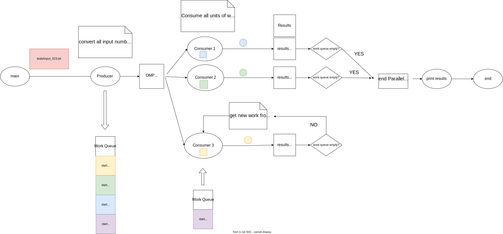

# Goldbach producer consumer (OpenMP)
The goal of this project is to implement the producer-consumer pattern in a simple way using OpenMP. to further reduce the duration of the program

## Results 
Time calculating file input023: 203.07 seconds (12 threads)

## Design
The goal of this design is to increase the execution speed of goldbach_pthread by using the concurrency pattern known as producer-consumer.

### Producer-Consumer (concurrency pattern)
There are many variants of the producer-consumer problem. In this case, first all the work is produced serially, and later consumers consume the work.

Taking into account that:

- The time it takes for the producer to generate the work does not justify the complexity generated by producing at the same time as consuming.
- It is not a case where you have to wait for user input to start processing as soon as the job is received, because the job is already predefined and does not change.

### Graphic concurrent design

### Work distribution
In this design, the main thread "producer" took all the number input and decomposed it into units of work for consumers, who permanently draw from a queue and stop when the queue is empty

