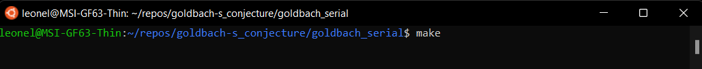
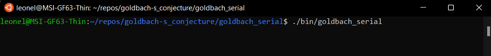
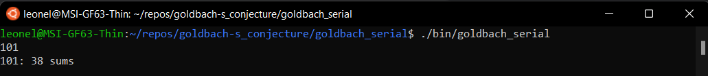
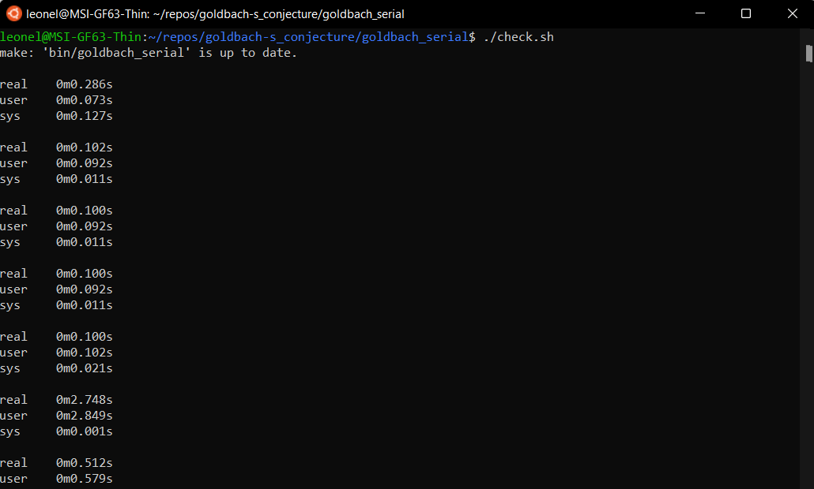

# Goldbach serial

This is the base program, it has an acceptable duration for small test cases, however it requires considerable time to obtain the solution for large test cases.

## User manual 
### How to make a manual test
1) Compile the program: make

2) Run the program: ./bin/goldbach_serial

3) Write a number and press enter

### How to make a automatic test
The script will execute all the test cases and report the time it took to execute each one.

1) Run the script: ./check.sh

## Results
Time calculating file input023: 792.41 seconds (1 thread)
