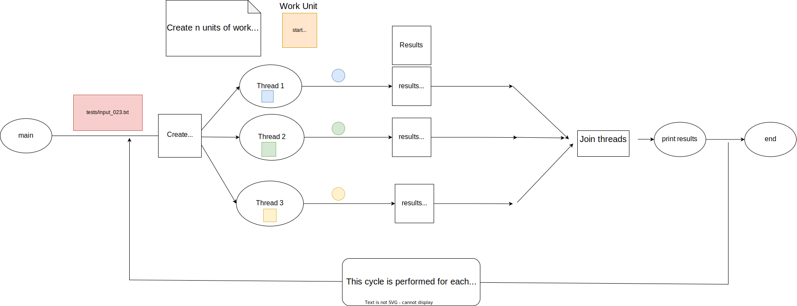

# Goldbach conditionally safe (pthread)
In this program it was possible to reduce the duration with respect to the serial version and now it has a more acceptable duration for the user.

## Results 
Time calculating file input023: 249.303 seconds (12 threads))

## Design
The goal of this design is to increase the execution speed of goldbach_serial by using the concurrency pattern known as conditionally safe.

### Conditonally safe (concurrency pattern)
Each thread does its work and places its results in a region of memory that only it can access.

### Graphic concurrent design

### Work distribution
In this case, hard work is the part of the code that requires more use of the cpu, so the work of the "first_adding" cycle will be distributed using the block mapping technique.

### Block mapping
This technique distributes units of work evenly across multiple threads, allocating overhead in some cases.

