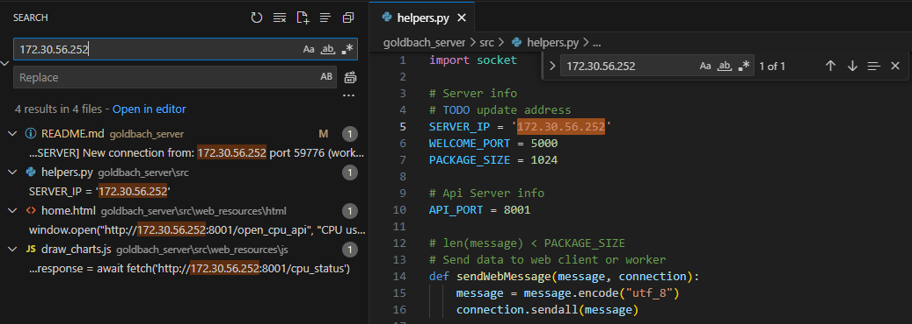
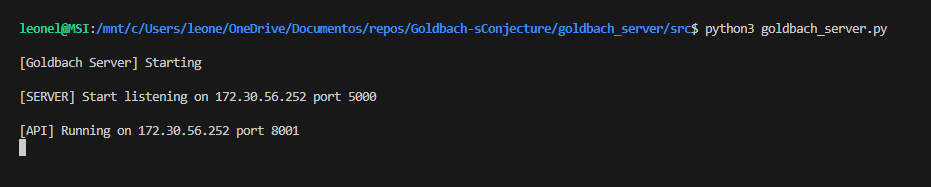
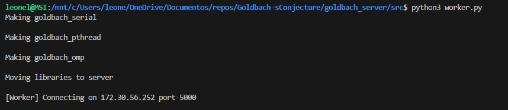

# Goldbach (server)
## Dependencies:
flask
pip
python3
psutil

## Running program on WSL2
To run the program in wsl2 it is necessary to configure the windows ports to connect with the virtual machine; this setting prepare port 5000 to recieve data and disable firewall to avoid communication problems. 

Steps:
- Open script directory: goldbach-s_conjecture\goldbach_server
- Run script: right click, run with powershell
- Allow script execution
- Choose option 1 (configure port, disable firewall)
- Choose option 2 (reset port, enable firewall)

- Replace the server IP with your own wsl ip given by:
wsl hostname -I on powershell terminal

## Starting server and worker
run python3 goldbach_server.py on a wsl terminal

run python3 worker.py on a wsl terminal

If you see this print on server terminal worker is succesfully conected:
[SERVER] New connection from: 172.30.56.252 port 59776 (worker)

Now you can open the web interface using 
http://YOURIP:5000/